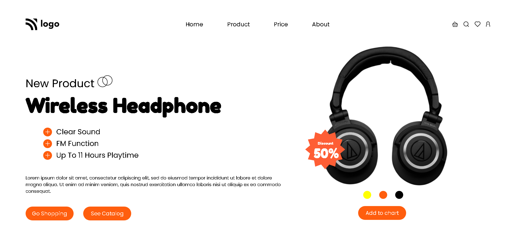

#  Product Home Page &nbsp;  &nbsp; 

## Skills acquired 👨‍💻

- Learned how to use media queries to make a responsive website.
- How to adjust the elements using css position properties.
-Learned how to makes use of  flexbox properties to align the items.

## Time taken to complete the project ⏲️

8hrs

## Screenshot &nbsp; 

 
 

 
 

